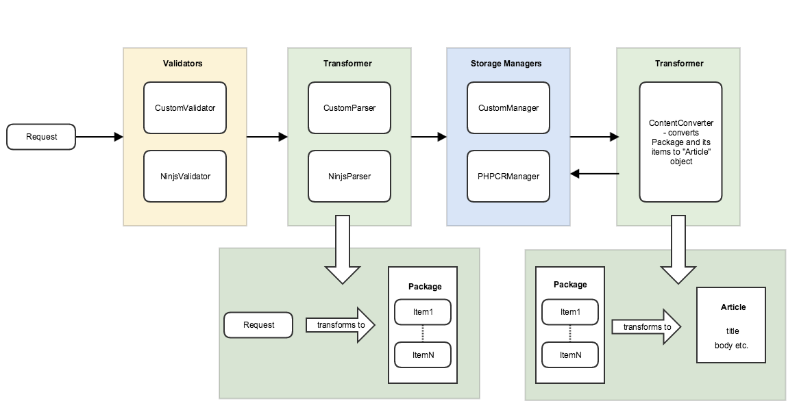

Usage
=====

.. _content_bundle_rules:

Rules to assign routes and/or templates to articles
---------------------------------------------------

With the API, it is possible to create and manage rules in order to assign a route and/or a template to content received in a package from a provider based on the metadata in that package.

The rules themselves are to be written in Symfony's expression language, documentation for which can be found here: http://symfony.com/doc/current/components/expression_language/syntax.html

The article document generated from the package can be referenced directly in the rule. So, here is an example of a rule:

.. code-block:: yaml

    'article.getMetadataByKey("var_name") matches "/regexExp/"'
    # ..
    'article.getMetadataByKey("urgency") > 1'
    # or
    'article.getMetadataByKey("lead") matches "/Text/"'
    # etc.

A priority can also be assigned to the rule. This is simply an integer. The rules are ordered by their priority (the greater the value, the higher the priority) before searching for the first one which matches.

The route to be assigned is identified by its id, for example:

.. code-block:: yaml

    'articles/features'

If a template name parameter (`templateName`) is given with the rule, this template will be assigned to the article instead of the one in the route.

Every rule is automatically processed when the content is pushed to ``api/v1/content/push`` API endpoint. The ``SWP\Bundle\ContentBundle\EventListener\ProcessArticleRulesSubscriber`` subscriber subscribes to
``SWP\Bundle\ContentBundle\ArticleEvents::PRE_CREATE`` event and runs the processing when needed.

Pushing Content to Web Publisher
--------------------------------

.. _content_bundle_content_push_endpoint:

Content Push API Endpoint
~~~~~~~~~~~~~~~~~~~~~~~~~

**Content Push API Endpoint**

+--------------+-------------------------------------------+
| Method       | URL                                       |
+==============+===========================================+
| POST         | /api/v1/content/push                      |
+--------------+-------------------------------------------+

**Resource details**

+-----------------+---------+
| Response format | JSON    |
+-----------------+---------+
| Authentication  | No      |
+-----------------+---------+

**Example Request**

.. code-block:: text

    POST https://<tenant_name>.domain.com/api/v1/content/push

**Example Response**

.. code-block:: json
    {
        "status": "OK"
    }

Response status code is ``201``.

.. _content_bundle_allowed_types:

Which content formats are allowed to be pushed?
~~~~~~~~~~~~~~~~~~~~~~~~~~~~~~~~~~~~~~~~~~~~~~~

The Superdesk Web Publisher can receive content of different formats, by default the `IPTC's`_ ninjs format is supported.

- `ninjs`_ - standardizes the representation of news in JSON - a lightweight, easy-to-parse, data interchange format.

In Superdesk Web Publisher we use an extension of the standard IPTC's ninjs format (to validate incoming request's content), which is extended by some additional fields:

- `uri` was replaced by `guid`: `uri` should be the resource identifier on the web but since the item was not published yet it can't be determined at this point
- added `priority` field
- added `service` field
- added `slugline` field
- added `keywords` field
- `associations` dictionary may contain entire items like in this ninjs example: http://dev.iptc.org/ninjs-Examples-3

By default, Superdesk Web Publisher is meant to work with our in-house content creation software called Superdesk which uses the above extension of ninjs format to store the data. That's why in Web Publisher the incoming content is being validated in the same format.

In the future we could also support other IPTC formats, like: `NewsML-G2`_, `NITF`_ etc. So you would be able to
push content to Web Publisher in format that fits you best.

Superdesk ninjs extension schema used by Web Publisher:

.. code-block:: json

    {
        "$schema": "http://json-schema.org/draft-03/schema#",
        "id" : "http://www.iptc.org/std/ninjs/ninjs-schema_1.1.json#",
        "type" : "object",
        "title" : "IPTC ninjs - News in JSON - version 1.1 (approved, 2014-03-12) / document revision of 2014-11-15: geometry_* moved under place",
        "description" : "A news item as JSON object -- copyright 2014 IPTC - International Press Telecommunications Council - www.iptc.org - This document is published under the Creative Commons Attribution 3.0 license, see  http://creativecommons.org/licenses/by/3.0/  $$comment: as of 2014-03-13 ",
        "additionalProperties" : false,
        "patternProperties" : {
            "^description_[a-zA-Z0-9_]+" : {
                "description" : "A free-form textual description of the content of the item. (The string appended to description_ in the property name should reflect the format of the text)",
                "type" : "string"
            },
            "^body_[a-zA-Z0-9_]+" : {
                "description" : "The textual content of the news object. (The string appended to body_ in the property name should reflect the format of the text)",
                "type" : "string"
            }
        },
        "properties" : {
            "guid" : {
                "description" : "The identifier for this news object",
                "type" : "string",
                "format" : "guid",
                "required" : true
            },
            "type" : {
                "description" : "The generic news type of this news object",
                "type" : "string",
                "enum" : ["text", "audio", "video", "picture", "graphic", "composite"]
            },
            "slugline" : {
                "description" : "The slugline",
                "type" : "string",
                "required" : true
            },
            "mimetype" : {
                "description" : "A MIME type which applies to this news object",
                "type" : "string"
            },
            "representationtype" : {
                "description" : "Indicates how complete this representation of a news item is",
                "type" : "string",
                "enum" : ["complete", "incomplete"]
            },
            "profile" : {
                "description" : "An identifier for the kind of content of this news object",
                "type" : "string"
            },
            "version" : {
                "description" : "The version of the news object which is identified by the uri property",
                "type" : "string"
            },
            "versioncreated" : {
                "description" : "The date and time when this version of the news object was created",
                "type" : "string",
                "format" : "date-time"
            },
            "embargoed" : {
                "description" : "The date and time before which all versions of the news object are embargoed. If absent, this object is not embargoed.",
                "type" : "string",
                "format" : "date-time"
            },
            "pubstatus" : {
                "description" : "The publishing status of the news object, its value is *usable* by default.",
                "type" : "string",
                "enum" : ["usable", "withheld", "canceled"]
            },
            "urgency" : {
                "description" : "The editorial urgency of the content from 1 to 9. 1 represents the highest urgency, 9 the lowest.",
                "type" : "number"
            },
            "priority" : {
                "description" : "The editorial priority of the content from 1 to 9. 1 represents the highest priority, 9 the lowest.",
                "type" : "number"
            },
            "copyrightholder" : {
                "description" : "The person or organisation claiming the intellectual property for the content.",
                "type" : "string"
            },
            "copyrightnotice" : {
                "description" : "Any necessary copyright notice for claiming the intellectual property for the content.",
                "type" : "string"
            },
            "usageterms" : {
                "description" : "A natural-language statement about the usage terms pertaining to the content.",
                "type" : "string"
            },
            "language" : {
                "description" : "The human language used by the content. The value should follow IETF BCP47",
                "type" : "string"
            },
            "service" : {
                "description" : "A service e.g. World Photos, UK News etc.",
                "type" : "array",
                "items" : {
                    "type" : "object",
                    "additionalProperties" : false,
                    "properties" : {
                        "name" : {
                            "description" : "The name of a service",
                            "type" : "string"
                        },
                        "code" : {
                            "description": "The code for the service in a scheme (= controlled vocabulary) which is identified by the scheme property",
                            "type" : "string"
                        }
                    }
                }
            },
            "person" : {
                "description" : "An individual human being",
                "type" : "array",
                "items" : {
                    "type" : "object",
                    "additionalProperties" : false,
                    "properties" : {
                        "name" : {
                            "description" : "The name of a person",
                            "type" : "string"
                        },
                        "rel" : {
                            "description" : "The relationship of the content of the news object to the person",
                            "type" : "string"
                        },
                        "scheme" : {
                            "description" : "The identifier of a scheme (= controlled vocabulary) which includes a code for the person",
                            "type" : "string",
                            "format" : "uri"
                        },
                        "code" : {
                            "description": "The code for the person in a scheme (= controlled vocabulary) which is identified by the scheme property",
                            "type" : "string"
                        }
                    }
                }
            },
            "organisation" : {
                "description" : "An administrative and functional structure which may act as as a business, as a political party or not-for-profit party",
                "type" : "array",
                "items" : {
                    "type" : "object",
                    "additionalProperties" : false,
                    "properties" : {
                        "name" : {
                            "description" : "The name of the organisation",
                            "type" : "string"
                        },
                        "rel" : {
                            "description" : "The relationship of the content of the news object to the organisation",
                            "type" : "string"
                        },
                        "scheme" : {
                            "description" : "The identifier of a scheme (= controlled vocabulary) which includes a code for the organisation",
                            "type" : "string",
                            "format" : "uri"
                        },
                        "code" : {
                            "description": "The code for the organisation in a scheme (= controlled vocabulary) which is identified by the scheme property",
                            "type" : "string"
                        },
                        "symbols" : {
                            "description" : "Symbols used for a finanical instrument linked to the organisation at a specific market place",
                            "type" : "array",
                            "items" : {
                                "type" : "object",
                                "additionalProperties" : false,
                                "properties" : {
                                    "ticker" : {
                                        "description" : "Ticker symbol used for the financial instrument",
                                        "type": "string"
                                    },
                                    "exchange" : {
                                        "description" : "Identifier for the marketplace which uses the ticker symbols of the ticker property",
                                        "type" : "string"
                                    }
                                }
                            }
                        }
                    }
                }
            },
            "place" : {
                "description" : "A named location",
                "type" : "array",
                "items" : {
                    "type" : "object",
                    "additionalProperties" : false,
                    "patternProperties" : {
                        "^geometry_[a-zA-Z0-9_]+" : {
                            "description" : "An object holding geo data of this place. Could be of any relevant geo data JSON object definition.",
                            "type" : "object"
                        }
                    },
                    "properties" : {
                        "name" : {
                            "description" : "The name of the place",
                            "type" : "string"
                        },
                        "rel" : {
                            "description" : "The relationship of the content of the news object to the place",
                            "type" : "string"
                        },
                        "scheme" : {
                            "description" : "The identifier of a scheme (= controlled vocabulary) which includes a code for the place",
                            "type" : "string",
                            "format" : "uri"
                        },
                        "qcode" : {
                            "description": "The code for the place in a scheme (= controlled vocabulary) which is identified by the scheme property",
                            "type" : "string"
                        },
                        "state" : {
                            "description" : "The state for the place",
                            "type" : "string"
                        },
                        "group" : {
                            "description" : "The place group",
                            "type" : "string"
                        },
                        "name" : {
                            "description" : "The place name",
                            "type" : "string"
                        },
                        "country" : {
                            "description" : "The country name",
                            "type" : "string"
                        },
                        "world_region" : {
                            "description" : "The world region",
                            "type" : "string"
                        }
                    }
                }
            },
            "subject" : {
                "description" : "A concept with a relationship to the content",
                "type" : "array",
                "items" : {
                    "type" : "object",
                    "additionalProperties" : false,
                    "properties" : {
                        "name" : {
                            "description" : "The name of the subject",
                            "type" : "string"
                        },
                        "rel" : {
                            "description" : "The relationship of the content of the news object to the subject",
                            "type" : "string"
                        },
                        "scheme" : {
                            "description" : "The identifier of a scheme (= controlled vocabulary) which includes a code for the subject",
                            "type" : "string",
                            "format" : "uri"
                        },
                        "code" : {
                            "description": "The code for the subject in a scheme (= controlled vocabulary) which is identified by the scheme property",
                            "type" : "string"
                        }
                    }
                }
            },
            "event" : {
                "description" : "Something which happens in a planned or unplanned manner",
                "type" : "array",
                "items" : {
                    "type" : "object",
                    "additionalProperties" : false,
                    "properties" : {
                        "name" : {
                            "description" : "The name of the event",
                            "type" : "string"
                        },
                        "rel" : {
                            "description" : "The relationship of the content of the news object to the event",
                            "type" : "string"
                        },
                        "scheme" : {
                            "description" : "The identifier of a scheme (= controlled vocabulary) which includes a code for the event",
                            "type" : "string",
                            "format" : "uri"
                        },
                        "code" : {
                            "description": "The code for the event in a scheme (= controlled vocabulary) which is identified by the scheme property",
                            "type" : "string"
                        }
                    }
                }
            },
            "object" : {
                "description" : "Something material, excluding persons",
                "type" : "array",
                "items" : {
                    "type" : "object",
                    "additionalProperties" : false,
                    "properties" : {
                        "name" : {
                            "description" : "The name of the object",
                            "type" : "string"
                        },
                        "rel" : {
                            "description" : "The relationship of the content of the news object to the object",
                            "type" : "string"
                        },
                        "scheme" : {
                            "description" : "The identifier of a scheme (= controlled vocabulary) which includes a code for the object",
                            "type" : "string",
                            "format" : "uri"
                        },
                        "code" : {
                            "description": "The code for the object in a scheme (= controlled vocabulary) which is identified by the scheme property",
                            "type" : "string"
                        }
                    }
                }
            },
            "byline" : {
                "description" : "The name(s) of the creator(s) of the content",
                "type" : "string"
            },
            "headline" : {
                "description" : "A brief and snappy introduction to the content, designed to catch the reader's attention",
                "type" : "string"
            },
            "located" : {
                "description" : "The name of the location from which the content originates.",
                "type" : "string"
            },
            "keywords": {
                "description" : "Content keywords",
                "type" : "array"
            },
            "renditions" : {
                "description" : "Wrapper for different renditions of non-textual content of the news object",
                "type" : "object",
                "additionalProperties" : false,
                "patternProperties" : {
                    "^[a-zA-Z0-9]+" : {
                        "description" : "A specific rendition of a non-textual content of the news object.",
                        "type" : "object",
                        "additionalProperties" : false,
                        "properties" : {
                            "href" : {
                                "description" : "The URL for accessing the rendition as a resource",
                                "type" : "string",
                                "format" : "uri"
                            },
                            "mimetype" : {
                                "description" : "A MIME type which applies to the rendition",
                                "type" : "string"
                            },
                            "title" : {
                                "description" : "A title for the link to the rendition resource",
                                "type" : "string"
                            },
                            "height" : {
                                "description" : "For still and moving images: the height of the display area measured in pixels",
                                "type" : "number"
                            },
                            "width" : {
                                "description" : "For still and moving images: the width of the display area measured in pixels",
                                "type" : "number"
                            },
                            "sizeinbytes" : {
                                "description" : "The size of the rendition resource in bytes",
                                "type" : "number"
                            }
                        }
                    }
                }
            },
            "associations" : {
                "description" : "Content of news objects which are associated with this news object.",
                "type" : "object",
                "additionalProperties" : false,
                "patternProperties" : {
                    "^[a-zA-Z0-9]+" :  { "$ref": "http://www.iptc.org/std/ninjs/ninjs-schema_1.0.json#" }
                }
            }
        }
    }

.. _IPTC's: http://dev.iptc.org/
.. _ninjs: http://dev.iptc.org/ninjs
.. _NewsML-G2: http://dev.iptc.org/G2-Standards
.. _NITF: http://dev.iptc.org/NITF

How Content is Pushed to Web Publisher?
~~~~~~~~~~~~~~~~~~~~~~~~~~~~~~~~~~~~~~~

Making a ``POST`` request to ``api/v1/content/push`` API endpoint, you can push whatever content you want in request's payload. See :ref:`content_bundle_content_push_endpoint` section.

The below diagram shows the data flow from the moment of their receipt by the ``content/push`` API endpoint
until it's saved as a resulting ``Article`` object in the persistence backend.

As you can see the request is being sent first, then the request's content is validated using Web Publisher validators (see validators :doc:`/bundles/SWPBridgeBundle/usage` section for more info about validators).

Once the content passes the validation (i.e. submitted content is for example in ninjs format), a respective transformer/parser (see :ref:`bridge_bundle_transformers` for more details) transforms (according to submitted content) the incoming data to format which is understandable by Web Publisher, i.e. ``Package`` and ``Item`` objects which are reflecting the submitted content.

Once this is done, the converted request's content is being persisted in Web Publisher persistence backend as a representation of ``Package`` and ``Item`` objects.

The last step is converting already persisted ``Package`` and ``Item`` objects to ``Article`` object which is used by Web Publisher internally and on which every operation is being made.

How the article's slug is being generated?
~~~~~~~~~~~~~~~~~~~~~~~~~~~~~~~~~~~~~~~~~~

The article's slug is being generated from the ``slugline`` field, if it is not empty, else the ``headline`` property's value (according to ninjs IPTC format) is used to populate the article`s slug.

.. warning::

    If the ``slugline`` property in incoming data is missing or is empty, the article's slug will be generated from the ``headline``, which means if you would want to change the ``headline`` and submit content again, a new article will be created instead as the article's slug will be generated from the ``headline`` field.

What happens when I want to change article's title?
~~~~~~~~~~~~~~~~~~~~~~~~~~~~~~~~~~~~~~~~~~~~~~~~~~~

You can change existing article's title in the content that you are sending to Web Publisher. Let's say we have a simple ``text`` `item` or `package` in ninjs format, as it is defined according to :ref:`content_bundle_allowed_types`.

Once the item/package ``headline`` is changed and the whole content is pushed to Web Publisher again, the article's title will be updated automatically.

What happens when I want to change article's slug?
~~~~~~~~~~~~~~~~~~~~~~~~~~~~~~~~~~~~~~~~~~~~~~~~~~

If an article already exists and you want to change the article's slug, the content which you used to create the article for the first time should be re-sent with modified ``slugline`` property.
Once you change the ``slugline`` property's value and submit it again to Web Publisher, a new article will be created.

How do I auto-publish an article?
~~~~~~~~~~~~~~~~~~~~~~~~~~~~~~~~~

In some cases, you will need to publish an article automatically, without additional action. In this bundle a special logic has been implemented which is responsible for the auto publishing articles, which is based on the rules. You can read more about rules in sections: :ref:`content_bundle_rules`, RuleBundle - :doc:`/bundles/SWPRuleBundle/usage` section.

All you need to do in order to auto-publish your articles, you need to first add a rule. If the article
will match the rule, it will be auto published.

Create a new rule:

.. code-block:: bash

    $ curl 'http://localhost/api/v1/rules/' -H 'Content-Type: application/x-www-form-urlencoded' --data 'rule%5Bpriority%5D=1&rule%5Bexpression%5D=article.getMetadataByKey(%22located%22)+matches+%22%2FSydney%2F%22&rule%5Bconfiguration%5D%5B0%5D%5Bkey%5D=published&rule%5Bconfiguration%5D%5B0%5D%5Bvalue%5D=true' --compressed

Submitted rule's expression:

.. code-block:: text

    article.getMetadataByKey("located") matches "/Sydney/"

Submitted rule's configuration:

.. code-block:: text

    rule[configuration][0][key]: published
    rule[configuration][0][value]: true

It means that if the above rule's expression matches to an article, it will apply the configuration to article.
In this case it will publish article.
