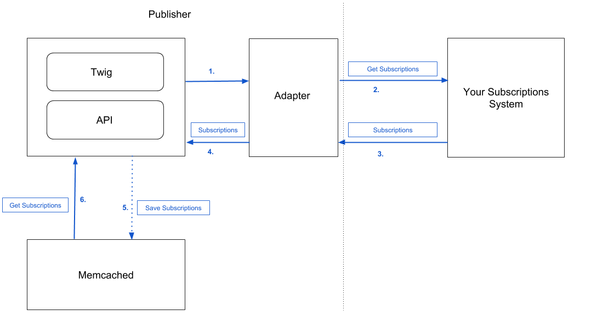

Paywall
=======

Paywall only retrieves the subscriptions data from an external Subscriptions System. In order to buy subscriptions,
you have to directly interact with the 3rd party Subscriptions System if you want to create new subscriptions.
For example, a simple JS application can be written where users can buy an access to the website.

How it works
------------

1. Your app (via API) or web front-end (via Twig) requests the subscriptions data.

2. The Publisher passes the request parameters to the adapter.

3. Adapter calls external Subscriptions System.

4. Once the connection is initialized and the adapter has made a request to Subscriptions System, the Subscriptions System communicates that information and returns a list of subscriptions or a single subscription.

5. Publisher then saves the retrieved subscriptions in the Memcached and caches it for 24 hours, by default. If the request parameters did not change, each request to get subscriptions will be executed to Memcached server.

6. The Publisher gets the subscription(s) from the Memcached.

How to configure subscriptions cache lifetime
---------------------------------------------

By default, the retrieved subscriptions are cached for 24 hours (86400 seconds). This can be changed
by setting ``env(SUBSCRIPTIONS_CACHE_LIFETIME)`` env var or parameter value to different number of seconds.

How to render user subscriptions in Twig
----------------------------------------

To render user subscriptions:

.. code-block:: twig

    
        Hey {{ app.user.username }}. <a href="{{ url('security_logout') }}">Logout</a>.
        
            {{ subscription.id }} # subscription's id, this is set in the Paywall Adapter
            {{ subscription.code }} # subscription's code, this is set in the Paywall Adapter
            {{ subscription.active }} # is subscription active, this is set in the Paywall Adapter
            {{ subscription.type }} # type of the subscription, this is set in the Paywall Adapter
            {{ subscription.details.articleId }} # an array with more details about the subscription, this is set in the Paywall Adapter
            {{ subscription.updatedAt|date('Y-m-d') }}
            {{ subscription.createdAt|date('Y-m-d') }}
        
    

To render a single user subscription by article id:

.. code-block:: twig

    
        Hey {{ app.user.username }}. <a href="{{ url('security_logout') }}">Logout</a>.
        
            {{ subscription.id }}
            # ...
        
    

To render a single user subscription by article id and name:

.. code-block:: twig

    
        Hey {{ app.user.username }}. <a href="{{ url('security_logout') }}">Logout</a>.
        
            {{ subscription.id }}
            {{ subscription.details.name }}
            # ...
        
    

How to check if used is "paywall-secured"
-----------------------------------------

Route and the article objects can be marked as "paywall-secured". This can be done via Routes API and Articles API by
setting the value of ``paywallSecured`` property to ``true``.

To check if the article or route is "paywall-secured" do:

Articles:

.. code-block:: twig

    
        
            # render content of the article
        
            # need to buy an access to read this article
        
        # ...
    

Routes:

.. code-block:: twig

    
        
            # render articles under this route
        
            # need to buy an access to read this section
        
        # ...
    

How to mark articles as paywall-secured using rules
---------------------------------------------------

Read more about it in :doc:`this section </cookbooks/developers/rules>`.

How to mark articles as paywall-secured by manually publishing packages
-----------------------------------------------------------------------

You can also directly publish a package and mark articles as "paywall-secured" by making a ``POST`` request to
``/api/v1/packages/<package_id>/publish/`` API endpoint with body:

.. code-block:: json

    {
        "publish":{
          "destinations":[
            {
              "tenant":"123abc",
              "route":6,
              "fbia":false,
              "published":true,
              "paywallSecured":true
            }
          ]
        }
    }

How to override paywall-secured option using publish destination
----------------------------------------------------------------

If there is a rule configured that marks all the articles matching given expression as "paywall-secured", you can use
publish destinations to override existing publish workflow for specific packages on specific tenants.

To do this, make a ``POST`` request to
``/api/v1/organization/destinations/`` API endpoint with body:

.. code-block:: json

      {
        "publish_destination":{
          "tenant":"123abc",
          "route":5,
          "fbia":false,
          "published":true,
          "paywallSecured":false,
          "packageGuid": "urn:newsml:sd-master.test.superdesk.org:2022-09-19T09:26:52.402693:f0d01867-e91e-487e-9a50-b638b78fc4bc"
        }
      }

The following destination will be processed when package will be published. The package will be published to tenant with code ``123abc``,
route with id ``5`` and won`t be marked as "paywall-secured" even if there is a rule marking it as paywall-secured.
