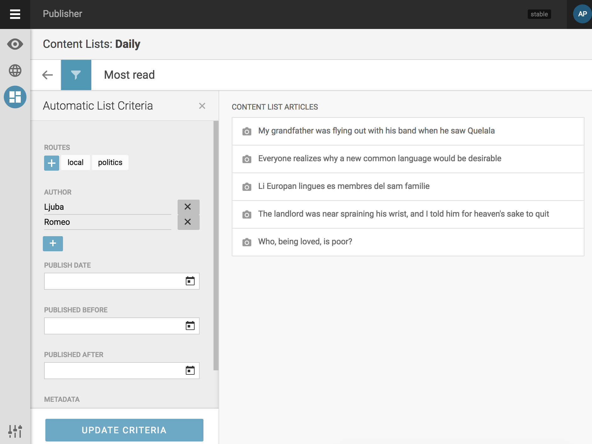
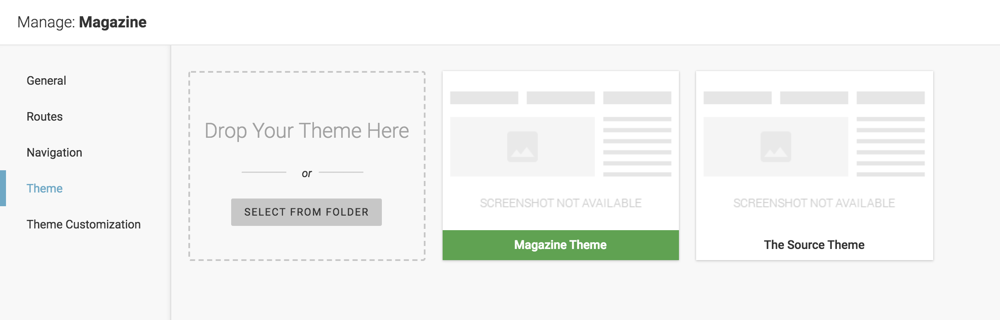
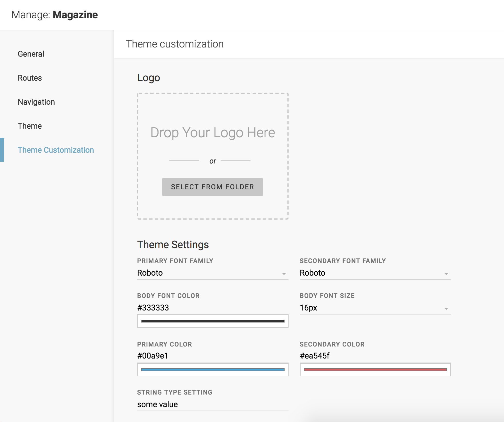
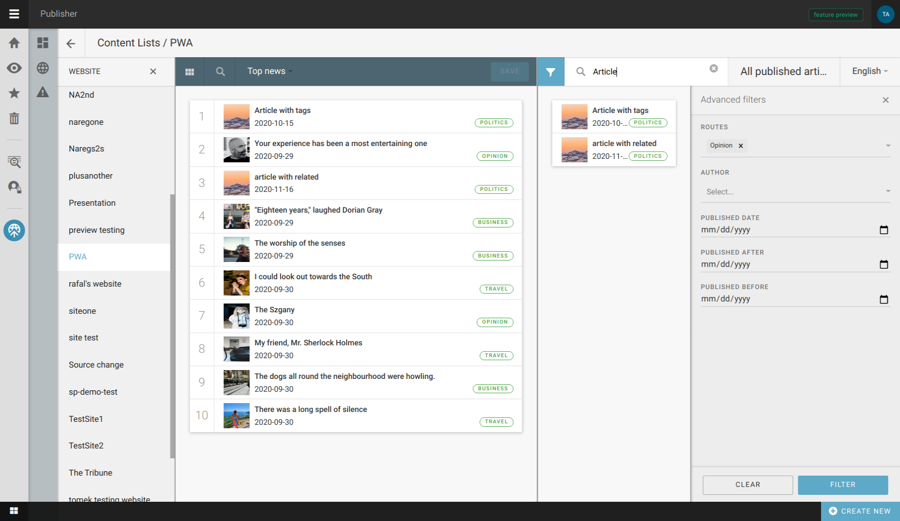

Content lists
'''''''''''''
Publisher offers the option to create manual or automatic content lists.

With automatic content lists, it is necessary to set up rules which will be used to fill the list with articles. It can be a single rule or a combination of several rules - route, author, date-based options, or one of many metadata values that are part of an article (for example: topic, category etc)

As you can see, setting automated list criteria is a straightforward process where you can define as many rules as you need.

When working with manual content lists, editors need to drag and drop stories from the right pane (showing all published articles) to the left pane. The order of articles here is the order in which they will appear on the front page.

Although the newest articles are on top of the listing, it is also possible to narrow down the number of articles shown in the right pane by using filtering options (top left button in that pane), or simply typing a keyword. 
