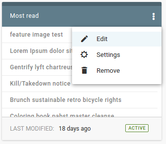
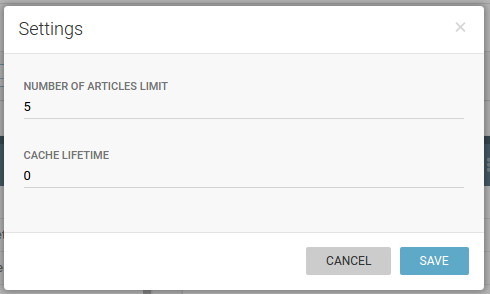

Content lists
=============
Publisher offers possibilites to create manual or automatic content lists.

.. image:: 08.png
   :alt: Create and manage content lists
   :align: center

With automatic content list, it is necessary to set up rules which will be used to fill the list with articles. It can be single rule or combination of several rules. To open the dialog with such options, there is the dialog that opens on three-dot button (another option in this dialogue is *settings*, which enables setting list limit and cache lifetime)

As you can see, setting automated list criteria is straight-forward process where you can define as many rules as you need.

.. image:: 11.png
   :alt: Setting criteria for automated list
   :align: center
