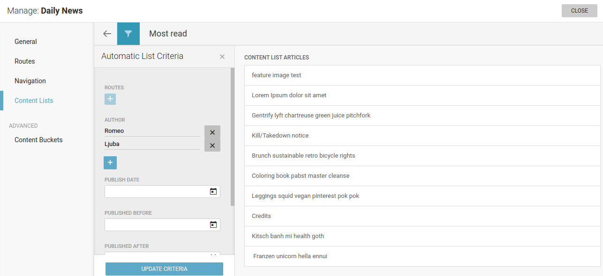

Content lists
'''''''''''''
Publisher offers possibilites to create manual or automatic content lists.

With automatic content list, it is necessary to set up rules which will be used to fill the list with articles. It can be single rule or combination of several rules - route, author, date-based options, or one of many metadata values that are part of article (for example topic, category etc)

.. image:: 12.png
   :alt: Setting criteria for automated content list
   :align: center

As you can see, setting automated list criteria is straight-forward process where you can define as many rules as you need.

.. image:: 13.png
   :alt: Working with manual content list
   :align: center

When working with manual content list, editors are supposed to drag and drop stories from the right pane (showing all published articles) to the left pane. Order of articles here is the order they will appear on front page.

.. image:: 14.png
   :alt: Filtering in the right pane
   :align: center

Although newest articles are on top of the listing, it is also possible to narrow down number of shown articles in the right pane by using filtering options (top left button in that pane), or simply typing a keyword. 
