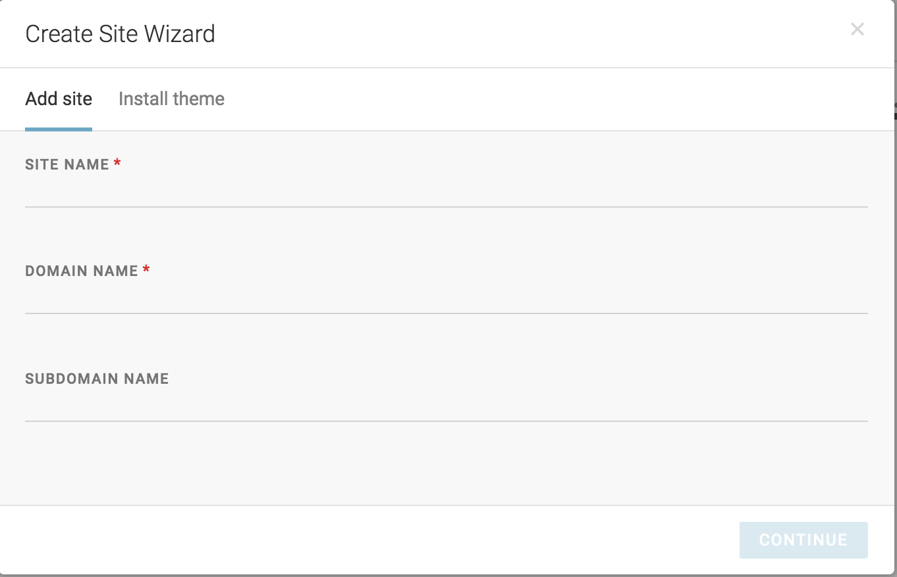
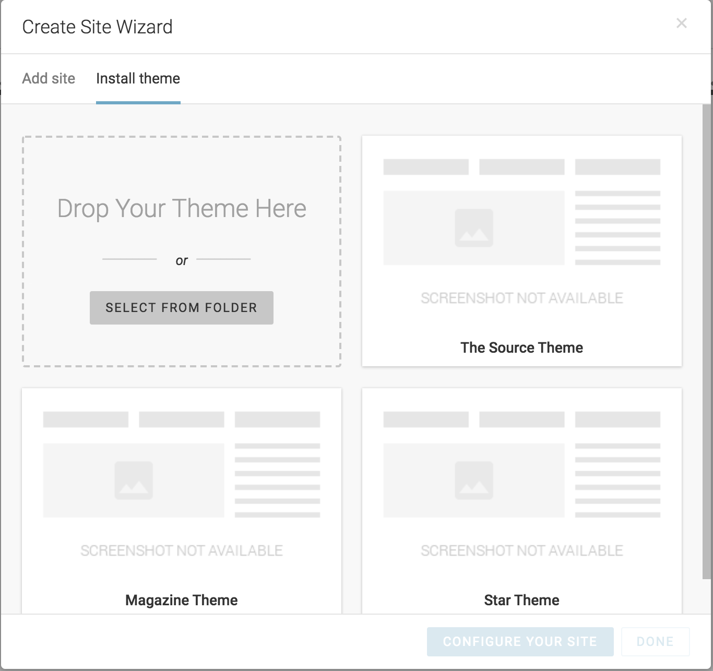

Creating new site
=================
Publisher offers possibilites to create and maintain many sites with one instance.

To create new site simply click big plus button in top right corner of **Output Settings** and follow Create Site Wizard steps.

First step is to fill site name and domain that points to publisher instance. Subdomain is optional.

Once site is created wizard will take you to next step where you can upload or use one of already installed themes. Once theme is installed and activated you can proceed to site configuration.
**Some themes support predefined data. It means that sample content will be created for you during installation process.**

