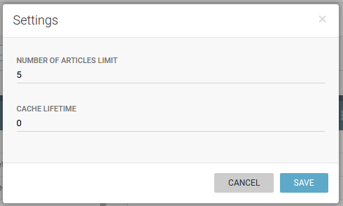

Publisher dashboard
===================

This screen is the starting point for working with content that arrives in Publisher (from Superdesk, some other CMS or even from an ingest source).

By default, the content list manager is shown. Here, every site that is configured (through :doc:`Publisher settings </manual/publisher_settings>`) is represented by the list of its content lists.   

.. toctree::
   :maxdepth: 2

   content_lists
   output_control
   error_log
