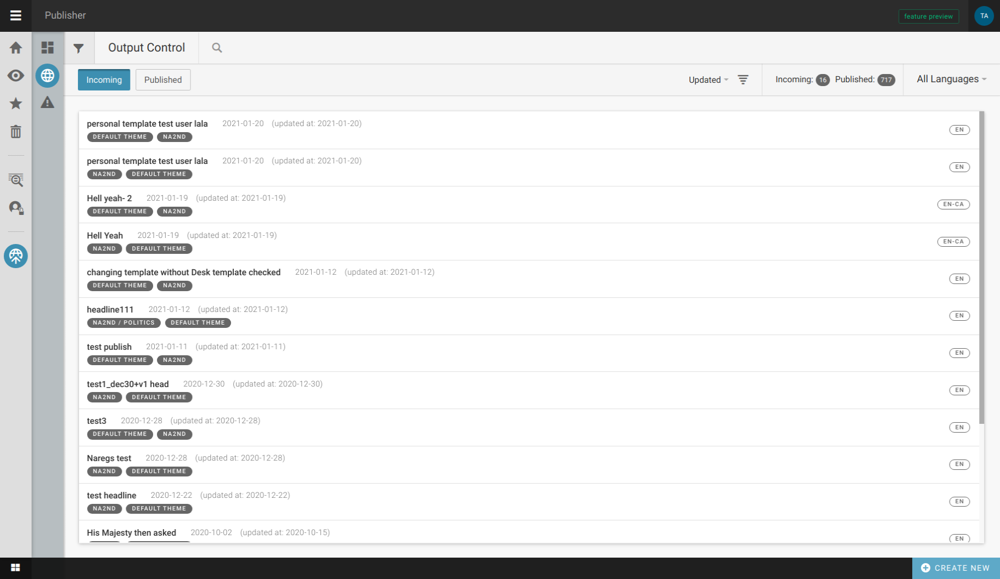
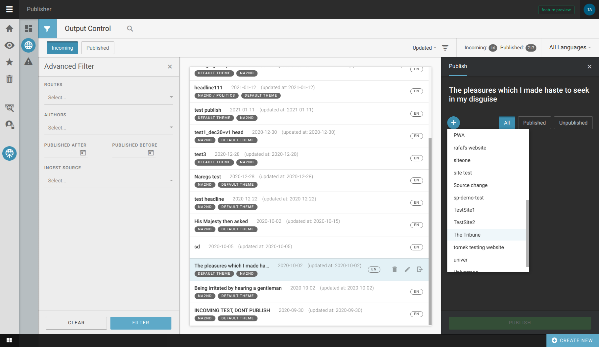
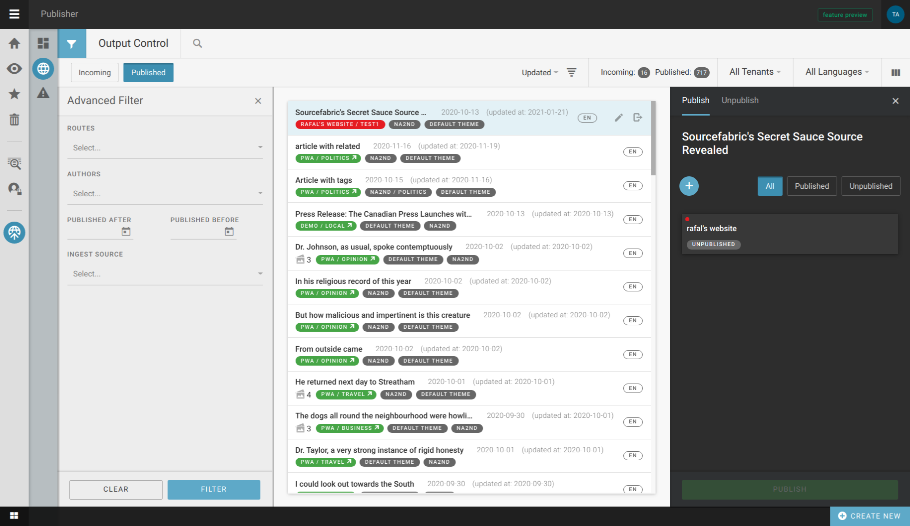

Output control
''''''''''''''

Output control displays content that comes to the Publisher instance, and is divided into two listings - *incoming* and *published* articles.

The *Incoming* list shows articles that have arrived in Publisher, but are not yet visible online. In order to get them online, they need to be assigned to a tenant, and route on which the article will be attached.

Also, it is possible to filter the list by keyword or by criteria.

The *Published* list is for manipulations with published content. There, one can change the route to which an article is attached, unpublish an article, publish it to additional tenants etc. This list can also be filtered to narrow down the search.
