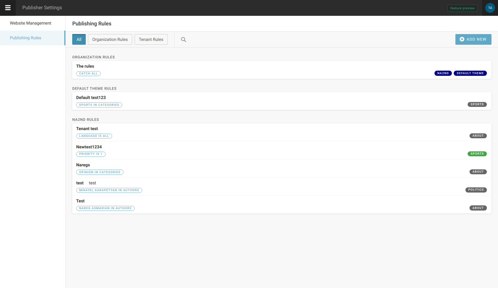
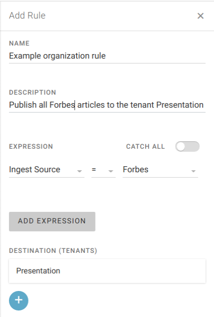
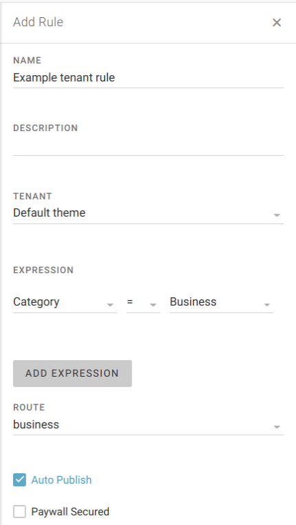

Publishing rules
''''''''''''''''

In Publisher, it is possible to automate content publishing, by setting rules that, when triggered, puts article online (thus publishing it to the tenant, and on the predefined route).

Triggering mechanism for publishing rules can be simple (single expression) or complex (multiple expressions - in which case they behave in the AND logical manner).

There two levels of rules - *organization rules* and *tenant rules*.

*Organization rule* is top-level rule which is meant to catch artilces on tenant level. There is even the switch _catch all_ which will publish all incoming content to specified tenant (keep in mind, though, that it is yet not enough for an article to get online! for that, route needs to be assigned too).

*Tenant rule* can be created only after defining organization rule for that tenant. It is logical - first we need to dirfect incoming article by organization rule, then specify under which conditions it gets assigned to specific route. For example, if article's metadata 'category' is set to 'Business', then publish that article to the route 'business'.
