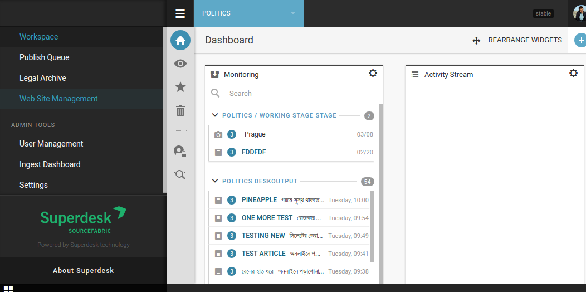
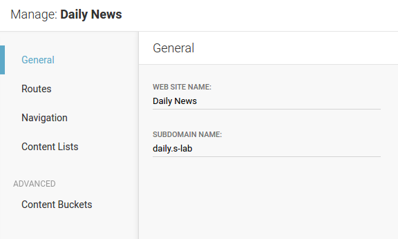
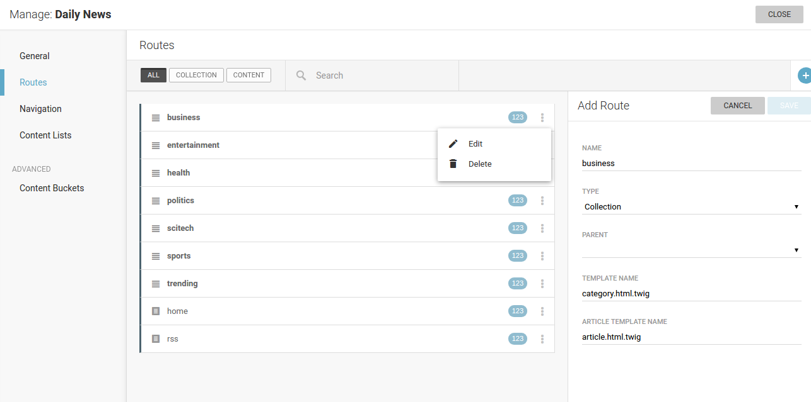
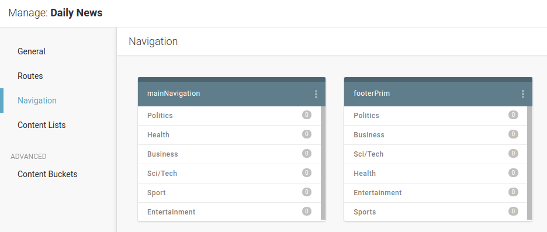

Site Management
===============

Publisher is built to work with any News API feed and thus it can be used as frontend solution for, say, Wordpress created content, or custom CMS solution, or just a feed that you subscribe for with some provider.

But if you use Publisher together with Superdesk, then you have **Web Site Management** GUI that integrates seemlesly to the Superdesk environment. From there, you can manage one or many websites (or, more generally, output channels) with as many tenants as you want.

In our example (screenshot 2) you can see three websites configured. As you can see, each site is represented with its name and list of assigned routes.

.. image:: 02.png
   :alt: Configured websites
   :align: center

Options to manage or delete websites are available after clicking on the three-dots icon.

.. image:: 03.png
   :alt: Website options
   :align: center

Next screenshot shows initial step in managing single website - set its name and (sub)domain.

Definition of site routes is the next step. Routes can be of type *collection* or *content* - former is category-like route to which articles are later attached, while latter is an end - with specific content assigned.

As you can see, route definition consists of name, type (*collection* or *content*), eventual parent route, template used to show this route, and article template to open articles attached to this route (if route is of type *collection*).

Third step in managing a website is to define its navigation. In other words, this option can be used to make navigation menus for header, footer, sidebar or wherever. If created this way, menu can be later also managed through LiveSite editing (of course, menus can also be defined in templates but then they are not dynamic in a way that can be managed y website editors).

Navigation menu consists on menu items - for example Home, Politics, Business etc. Each of these *menu items* is defined by name, label, parent, route (pre-defined in previous step) and uri.

.. image:: 07.png
   :alt: Manage site navigation
   :align: center

Fourth step in site management offers possibilites to choose or change theme.

.. image:: 12.png
   :alt: Theme manager
   :align: center

You can either upload your custom theme or choose one of available themes form list. Currently used theme is marked with green background.

.. image:: 13.png
   :alt: Theme customization
   :align: center

If selected theme supports :doc:`Theme Settings </manual/theme_settings>` you can also customise your theme with GUI.