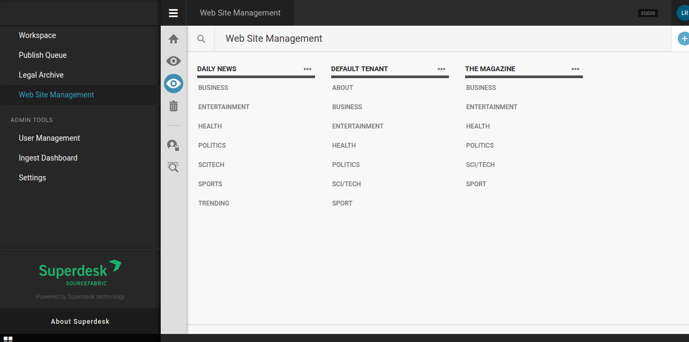
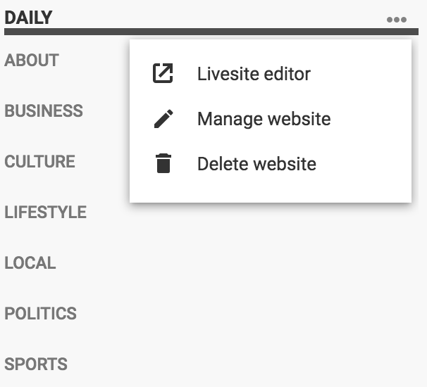
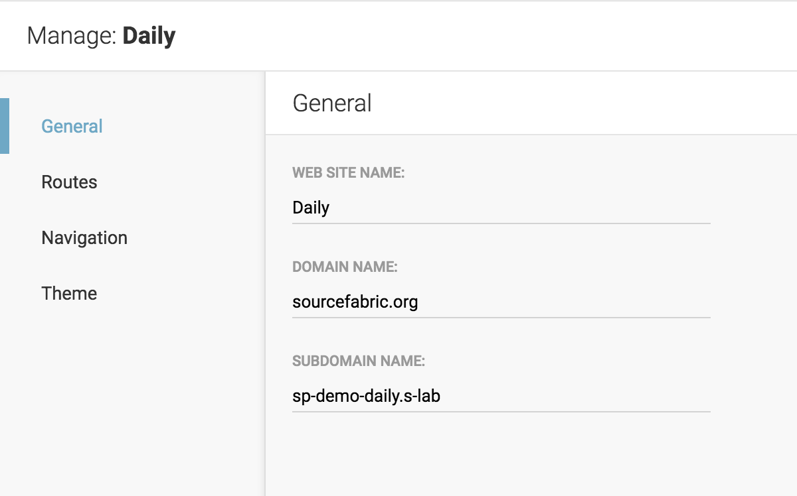
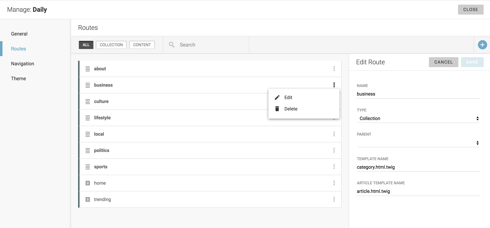
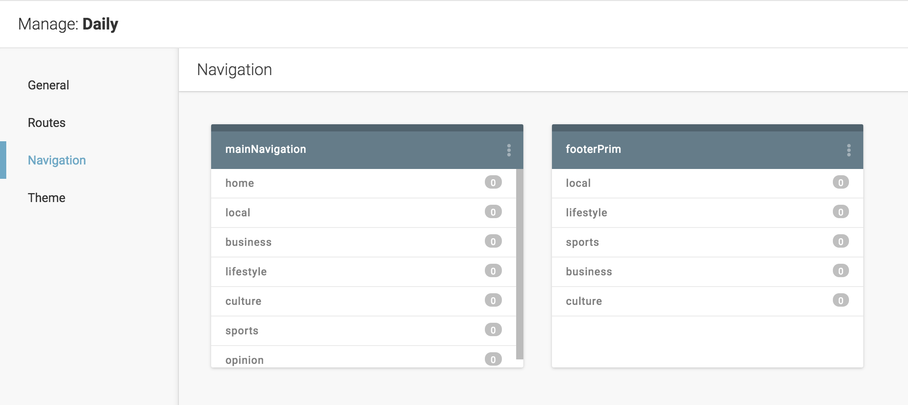
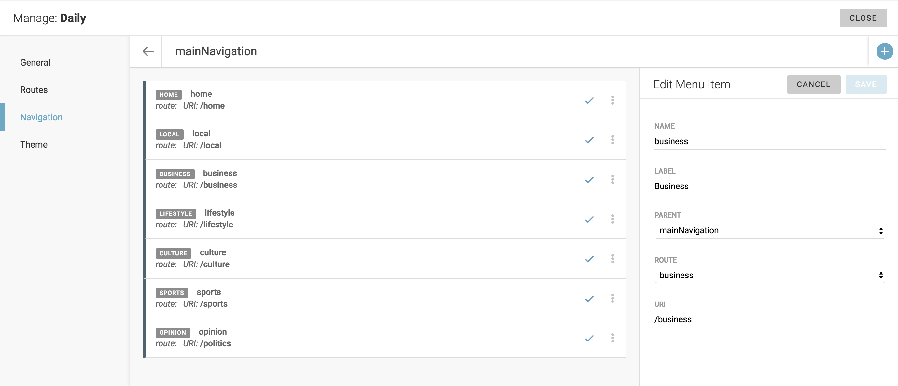
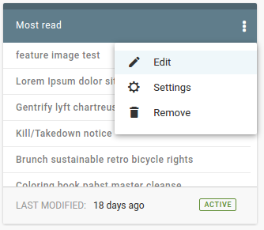

Website Management
''''''''''''''''''

.. image:: 01.png
   :alt: 1) Initial Dashboard
   :align: center

In our example (screenshot 1) you can see several websites configured. As you can see, each site is represented with its name (which links to front-end) and list of avaialble settings.

Options to manage or delete websites are available after clicking on the three-dots icon.

Next screenshot (2) shows initial step in managing single website - set its name and (sub)domain, language(s) and other options.

Definition of site routes is the next step (3). Routes can be of type *collection*, *content* or *custom* - first is category-like route to which articles are later attached, second is an end - with specific content assigned, while third is for creating dynamic routes based on author-name, tag or other dynamic value.

As you can see, route definition consists of name, type (*collection*, *content* or *custom*), eventual parent route, template used to show this route, and article template to open articles attached to this route (if route is of type *collection*). There is also switch 'Paywall secured' which can be used to indicate locked content (and thus open it only to, say, logged-in users).

Third step in managing a website is to define its navigation. In other words, this option can be used to make navigation menus for header, footer, sidebar or wherever. If created this way, menu can be later also managed through LiveSite editing (of course, menus can also be defined in templates but then they are not dynamic in a way that can be managed y website editors).

Next option is to control site redirects (4), which can be *route to route*, or *custom* url redirections. 

In navigations (5), it is possible to create dynamic site menus, so they can be changed/adjusted by site editors (and not technical people exclusivelly).

Navigation menu consists on menu items that can be either route based (Politics, Business etc), or leading to custom url. Each of these *menu items* is defined by name, label, parent, route (pre-defined in previous step) and/or uri.

Webhooks 

.. image:: 08.png
   :alt: 8) Theme manager
   :align: center

Next step in site management offers possibilites to choose or change theme (8).

You can either upload your custom theme or choose one of available themes form list. Currently used theme is marked with green background.

If selected theme supports :doc:`Theme Settings </manual/theme_settings>` you can also customise your theme with GUI.
