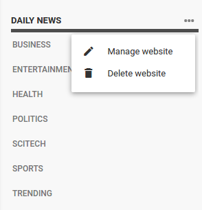
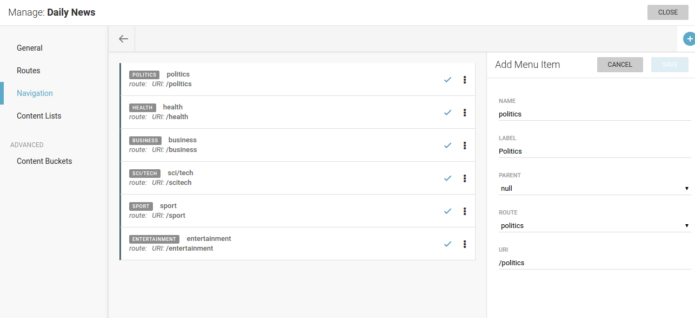
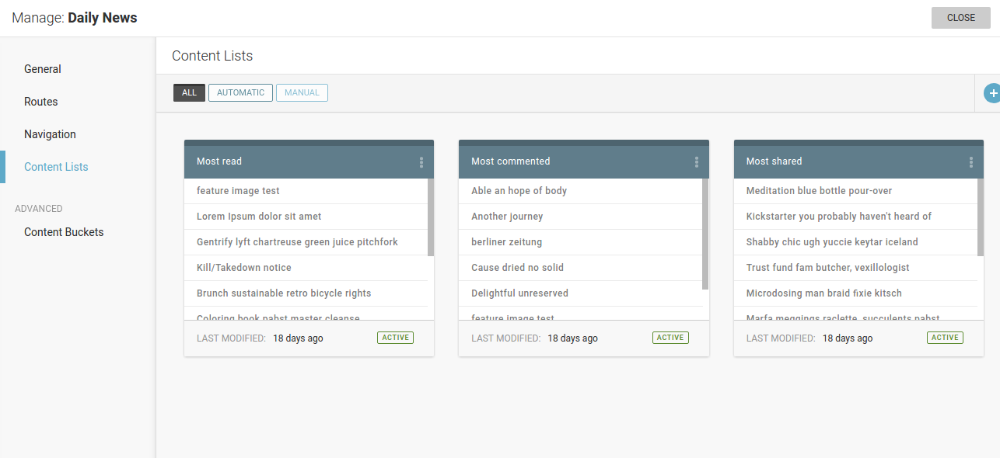

Website Management
''''''''''''''''''

.. image:: 01.png
   :alt: 1) Initial Dashboard
   :align: center

In our example (screenshot 1) you can see several websites configured. As you can see, each site is represented with its name (which links to the front end) and list of available settings.

Options to manage or delete websites are shown after clicking on the three-dots icon.

Next screenshot (2) shows initial step in managing a single website - set its name and (sub)domain, language(s) and other options.

Definition of site routes is the next step (3). Routes can be of type *collection*, *content* or *custom* - the first is a category-like route to which articles are later attached, second is an end - with specific content assigned, while the third is for creating dynamic routes based on author name, tag or other dynamic value.

As you can see, the route definition consists of name, type (*collection*, *content* or *custom*), eventual parent route, template used to show this route, and article template to open articles attached to this route (if route is of type *collection*). There is also a switch called 'Paywall secured' which can be used to indicate locked content (and thus open it only to, say, logged-in users).

The third step in managing a website is to define its navigation. In other words, this option can be used to make navigation menus for a header, footer, sidebar or wherever. If created this way, the menu can be later also managed through LiveSite editing (of course, menus can also be defined in templates but then they are not dynamic in a way that can be managed by website editors).

.. image:: 04.png
   :alt: 4) Manage site redirects
   :align: center

Next option is to control site redirects (4), which can be *route to route*, or *custom* url redirections. 

.. image:: 05.png
   :alt: 5) Site menus
   :align: center

In navigations (5), it is possible to create dynamic site menus, so they can be changed/adjusted by site editors (and not technical people exclusively).

.. image:: 06.png
   :alt: 6) Manage site navigation
   :align: center

Navigation menu consists of menu items that can be either route-based (Politics, Business etc), or leading to a custom url. Each of these *menu items* is defined by name, label, parent, route (pre-defined in previous step) and/or uri.

Webhooks

Webhooks are HTTP callbacks (with associated URLs) defined by the user. Some events trigger them. Superdesk Publisher uses webhooks to notify external applications when an event happens in Publisher. Examples of these events include: when an editor publishes/unpublishes/updates an article; when a website administrator creates a new route or creates a menu.

The next step in site management offers possibilites to choose or change themes (8).

You can either upload your custom theme or choose one of available themes from the list. The current theme is highlighted in green.

.. image:: 09.png
   :alt: 9) Theme customization
   :align: center

If a selected theme supports :doc:`Theme Settings </manual/theme_settings>` you can also customise your theme with GUI.
