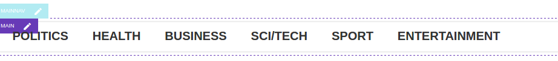
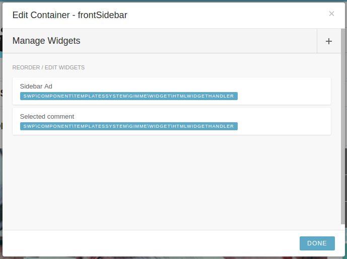
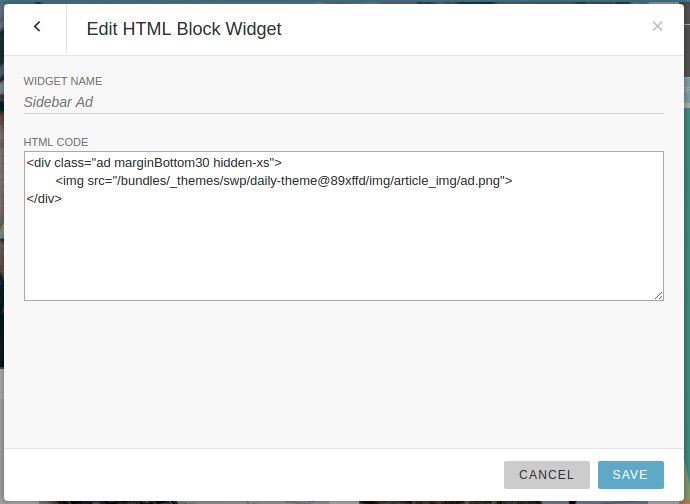

Livesite Editor
===============

What is Livesite Editor?
------------------------

With LiveSite editor, Publisher offers website editors possibility to manage and manupulate containers and widgets web page is built of, directly on frontend. Yes, this means that when such person is authenticated, page structure will get interactive and tool pallettes will appear.

Editing content directly in frontend
------------------------------------

So when website editor with such privileges authenticates, page structure gets interactive in a way that containers that exist on it are marked with descrete border and label. On hover action, also widgets are marked in different colour, and both *containers* and *widgets* configuration button can activate modal dialog with options.

Options when live-editing containers are

- add new widget to container (possible types of widgets to add are: *Content List Widget*, *HTML Widget*, *Google Adsense Widget*, *Menu Widget*)
- remove widget from container
- re-order widgets inside container   

Options when live-editing widgets are

- edit widget name
- depending on widget type, different fileds will be editable. For example:
  - for Menu Widget, dropdown to chose which menu to link to the widget, and template name of the template that will be used to create menu
  - for HTML widget, text area with html code

Livesite Editor interface
-------------------------

Interface for LiveSite editor is fairly simple; editing is turned on (again, only for authorized users) by pressing the top-left corner button - it reveals top toolbar with options to jump between *live site* and *current revision*, as well as *publish* buttons which deploys applied changes to the live site.

In the same time, as toolbar is activated, containers become marked and interactive on hover, showing widget's borders and label.

Clicking on edit icon next to container label opens options modal

Clicking on edit icon next to widget label opens options modal

