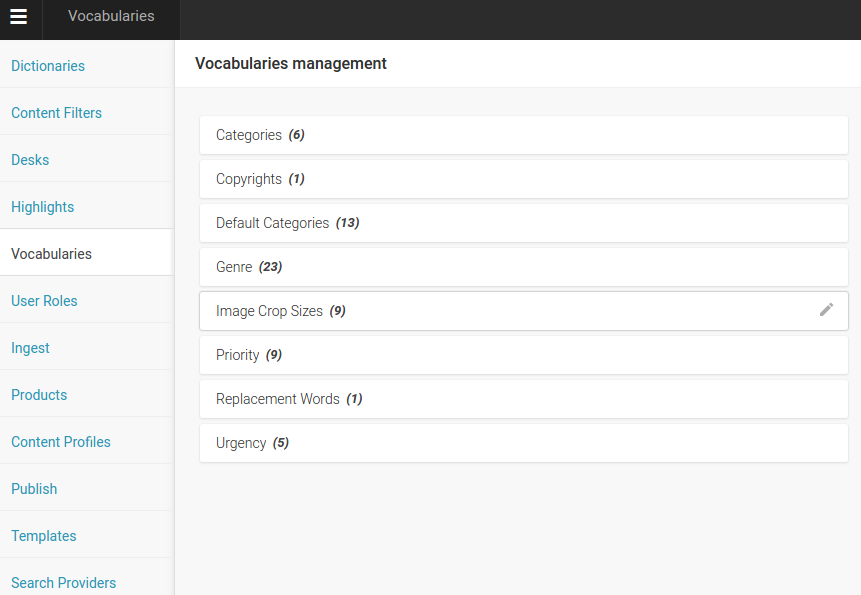
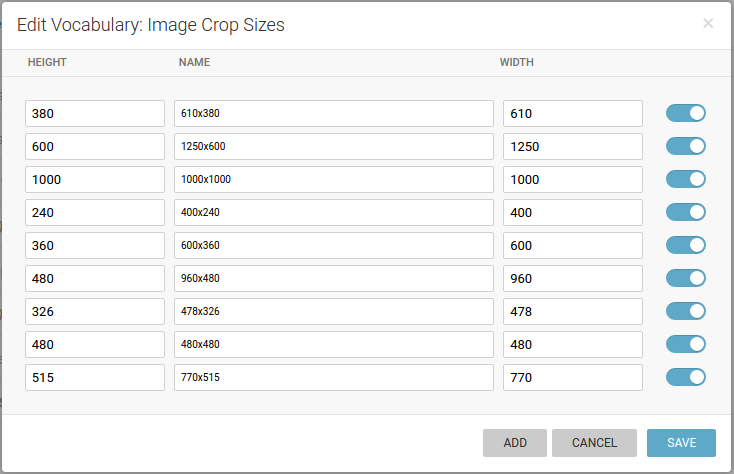
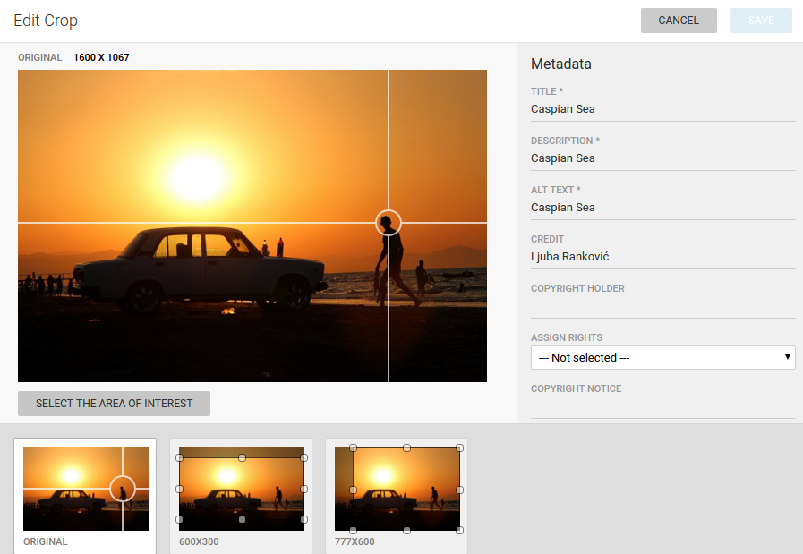

Configure image formats
=======================

In Superdesk `Settings -> Vocabularies -> Image Crop sizes` it is possible to define all needed image sizes.

If you are configuring one website, depending on the layout design it can require one image size for lead story on front, another one for second-level stories, thumbnail image for small teasers, big article page image, and finally image size optimized for Facebook sharing for example. 

So all these sizes should be crops of originally uploaded image that journalist or editor are adding to the story as feature image (one that represents the story in teasers).

If you have more websites powered by one Superdesk instance, then all of the needed crops are defined here.

Even though original image gets cropped automatically, this process can be overviewed and best *point of interest* and *area of interest* are customizable.

