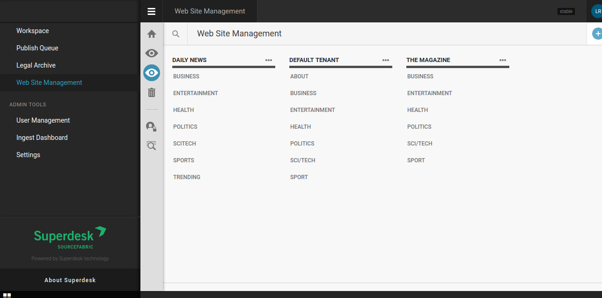

Managing of the websites and routes
===================================

When Publisher is installed, it is integrated in Superdesk and it expects output channels (or, in other words - websites) to be set - it is already mentioned in :doc:`Configuring Publisher </manual/getting_started/publisher-configuration>`.

Main concepts are: 

- there can be more than one websites that you can configure and feed from Superdesk
- each website is configured firstly by its **routes**; routes can be of type *collection*, *content* and *custom*.

Route of type *collection* is expected to get articles attached to it - think of it as some kind of category page (Business, or Politics, or simply News). When configuring such route, you need to also specify article template name - the one that will be used to show articles attached to that route.

.. image:: websites-routes-02.png
   :alt: Creating a route
   :align: center

Route of type *content* is the end of the road - it holds the content! No articles are attached to it! So it can be either some special template (contact form, confirmation page, or simply a route that doesn't directly hold attached articles, like 'home' route for example).
