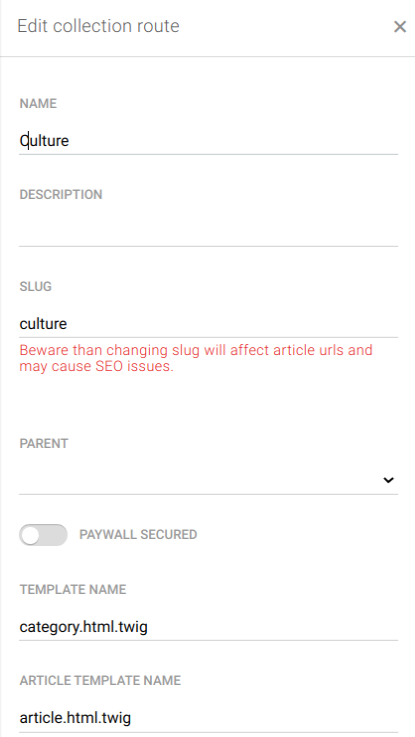
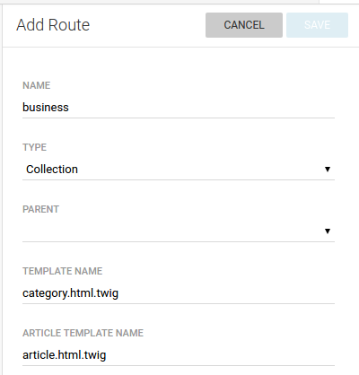
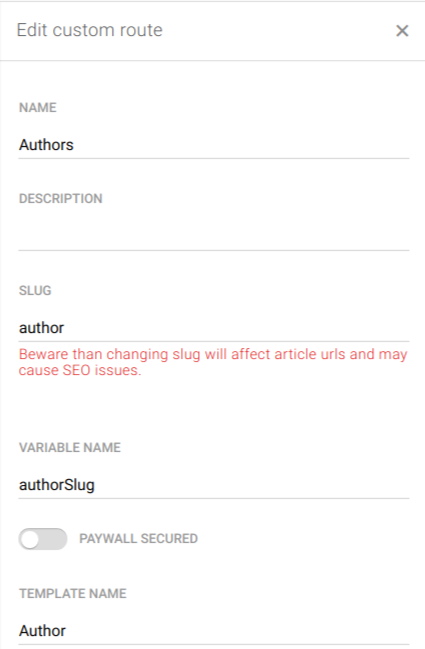

Managing of the websites and routes
===================================

When Publisher is installed, it is integrated in Superdesk and it expects output channels (or, in other words - websites) to be set - it is already mentioned in :doc:`Configuring Publisher </manual/getting_started/publisher-configuration>`.

Main concepts are: 

- there can be more than one websites that you can configure and feed from Superdesk
- each website is configured firstly by its **routes**; routes can be of type *collection*, *content* and *custom*.

Route of type *collection* is expected to get articles attached to it - think of it as some kind of category page (Business, or Politics, or simply News). When configuring such route, you need to also specify article template name - the one that will be used to show articles attached to that route.

Route of type *content* is the end of the road - it holds the content! either only one article is attached to it, or no articles at all! So it can be either static article page (About us), or some special template (contact form, confirmation page, or simply a route that doesn't directly hold attached articles, like 'home' route for example, or Trending articles, which would use special tempalte to show that kind of content).

Routes of type *custom* are dynamically generated and thus have more technical aspect in it's essence. They are used to define ie. author profile routes - /author/john-smith, /author/sarrah-staffwriter etc. First part is static ('author'), while second part is dynamic and based on author slug in this case. Written in json format, custom route definition looks like this:

.. code-block:: JSON
   {
      "name": "Author",
      "slug": "author",
      "type": "custom",
      "requirements": [
         {
            "key": "authorSlug",
            "value": "[0-9a-zA-Z\\-_]+"
         }
      ],
      "variable_pattern": "/{authorSlug}",
      "template_name": "author.html.twig"
   }

Theme developer needs to get autohor slug value from the context and construct url dynamically using it.  
