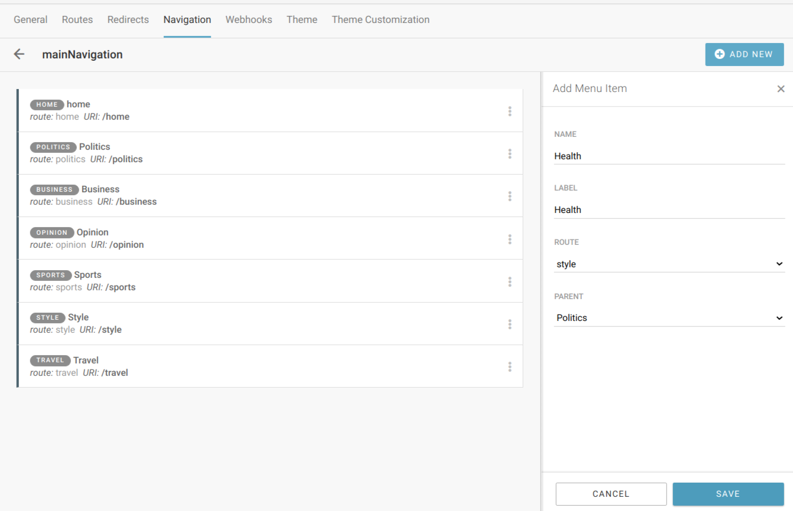

Navigation management
=====================

**Navigations** are menus that you can use on your websites. The advantage of creating them here (and not building the navigation menu only in the theme) is that they can later be managed via the Superdesk Publisher interface (meaning menu items added, removed and reordered) even by website editors, and not just theme developers. 

.. image:: navigation-management-01.png
   :alt: Navigation management
   :align: center

Only after configuring *Routes*, we can proceed to configure *Navigation*. That's because navigation is built on **menu items**, and menu items are partly defined by routes. 

.. image:: navigation-management-02.png
   :alt: Menu item type
   :align: center

However, it doesn't have to be the case, as menu items can also have custom URIs. But as SEO algorithms sort-of penalize navigations with external links, it should be used wisely (ie. to make a link to a specific custom route).

The elements needed for **menu item** definition are:

- Name
- Label - the value that is shown on the front end for that menu item in the navigation menu
- Parent - useful when building nested, drop-down menus
- Route - one of previously defined routes
- Uri - automatically filled in when route is selected
