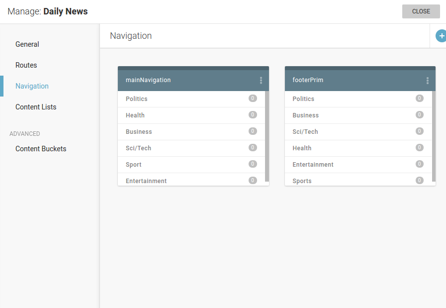
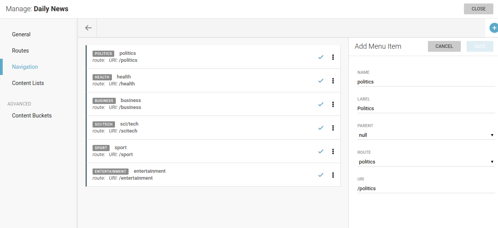

Navigation management
=====================

**Navigations** are menus that you can use on your websites. Advantage of creating them here (and not building navigation menu 
only in template) is that it can later be managed (meaning menu items added, removed and reordered) even by website editors, 
and not template developers. And when we say managed, we mean managed in Superdesk's Publisher Settings interface.

Only after configuring *Routes*, we can proceed to configure *Navigation*. That's because navigation is built 
of **menu items**, and menu items are partly defined by routes.

All elements of **menu item** definition are

- Name
- Label - value that is shown on frontend for that menu item in navigation menu
- Parent - useful when building nested, drop-down menus
- Route - one of previously defined routes
- Uri - automatically filled in when route is selected
