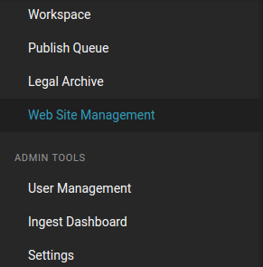

Configuring Publisher
=====================

Publisher integrates into Superdesk simply by adding new option *Publisher Settings* to its main left-hand sidebar navigation.

This option, when chosen, opens Publisher configuration which allows configuring one or more websites. 
Setting a website actually means defining routes, creating navigation menus (whose menu items are linked to these routes), 
and creating content lists. 

Detailed explanation of website management steps can be found in chapter :doc:`Admin interface </manual/admin_interface/index>`
