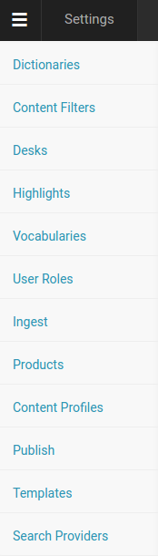
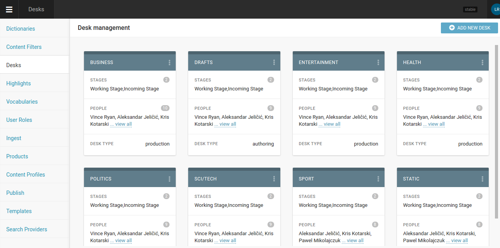
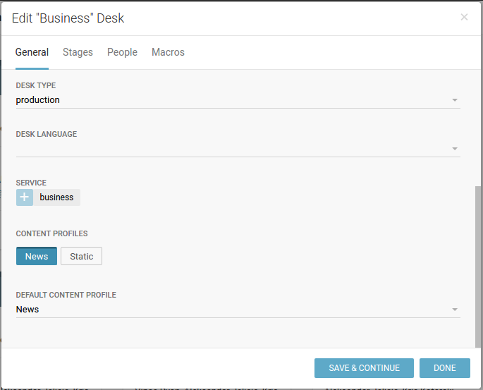
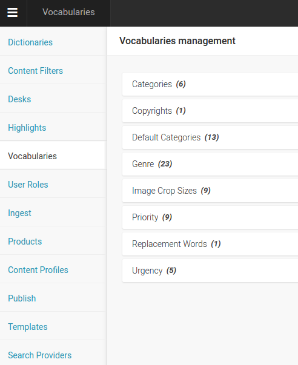
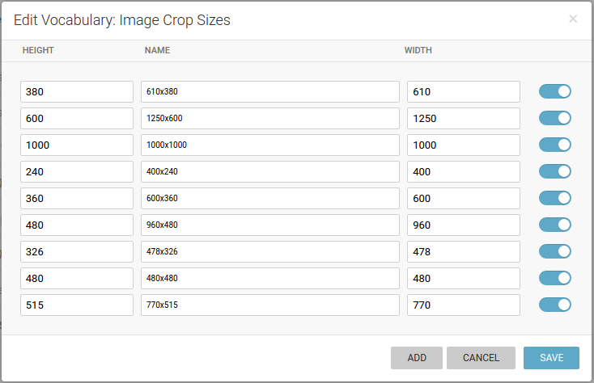
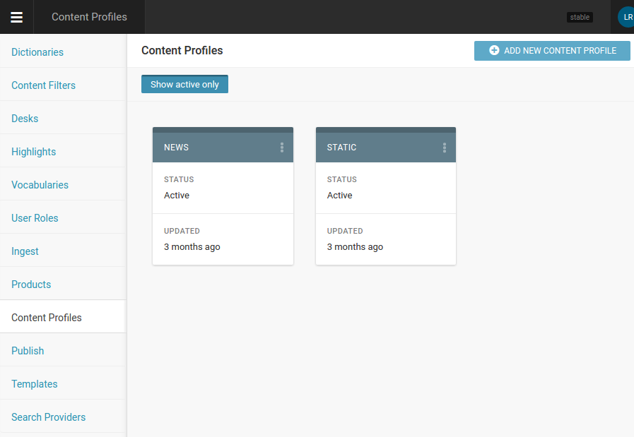
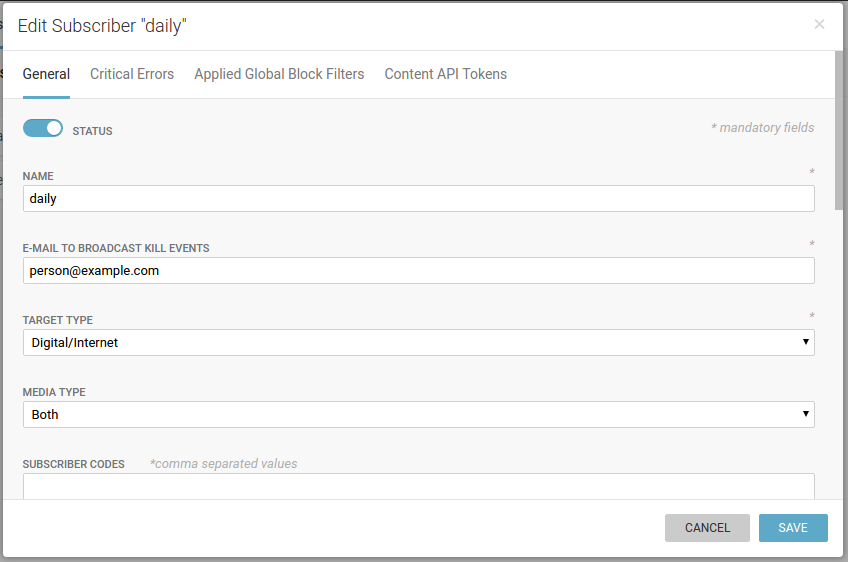

Superdesk configuration
=======================

As being such flexible and powerful beast, Superdesk needs to be configured correctly in order to deliver right content to right output channel, in appropriate formats and to desired paths based on set-up rules.

We will of course focus only on those settings directly related to successful publishing to Publisher-powered website.

Desks
-----

Concept of Superdesk desks can be used in different ways - they can be created to represent website categories (Politics, Business etc), but also there can be just one or two desks that divide content by its type (news, static pages etc). So based on the logic how desks are used, they can be configured to use specific content type, and to publish content to specific route by default - but don't have to (these decisions, to which route to publish and wich content type to use, can be made separately for every new content item that you create).

Desk settings (accessible upon clicking three-dots icon in desk's right top corner) can be used for this kind of semi-automation: 

*Service* is directive that tells system to which route to publish by default (and these are created inside Vocabularies/Categories). *Content profiles* is list of configured types of content, and one can be used to be desk's default.

Vocabularies management
-----------------------

**Categories** can be used to define *services* (see above) which are assigned to Desks.

**Image Crop Sizes** are definitions of image sizes that are used on your output channels. For example, there can be three websites configured with *Web Site Manager*, and each of them uses several cropping dimensions - lead story on front, second-level stories on front page, story thumbnails, article page big image, etc.

And this is exactly what we can configure in *Image crop sizes* settings; original images that are uploaded for the story will be cropped to all these different recangular or square crops and delivered to output channels.

This process is automatic, but can be overviewed by uploaders and editors to be sure that best *point of interest* and *area of interest* are chosen for every single crop size.

Content profiles
----------------

*Content profiles* are the types of content that are being created in Superdesk. They can be dead simple or pretty complex, depending on your needs and nature of the content being created. On our screenshot example above, you can see common situation when output channel receives 'news' articles and 'static' pages.

Schema configuration possibilities for content profile are numerous; this is the list of them all:

- ANPA Category
- Company codes
- Genre
- Byline
- Slug
- Headline
- Priority
- Footer
- SMS
- Abstract
- Feature Media
- Media Description
- Dateline
- Sign Off
- Body footer
- Body HTML
- Editorial Note
- Urgency
- Subject
- Place
- Take Key

Every of these fields can be fine-tuned to suite your needs - from *length*, *formatting* options and *order*, to *setting its mandatoryness* on or off and *clean paste html* for example. We encourage you to explore these possibilities on your own!

Keep in mind that Superdesk can also deliver **content packages** to outside world. And package can be combination of more content items, every one of different profile.

Publish
-------

This is where we tell superdesk about our output channels, or **subscribers** (because Superdesk is used not only to send content to Publisher - it is built to serve *all* needs of even biggest news agancies and media companies, *subscriber* can be another news producing company, or anything really, so package they receive may be far more complex and different from only web site publisher needs). 

So we can configure only one *subscriber* with one website, or more subscribers - superdesk can feed them all with content that fits their requirements.

Explanation of options (Publisher-desired values are marked with \*):

- Status: active or not
- Name
- E-mail to broadcast kill events: kill events are articles that are *killed* in Superdesk and need to be unpublished from output channel. This is automatic process
- Target type: choose between Digital/Internet*, Wire/Paper, or All
- Media type: choose between Media, Non-media or Both*
- Targetable by users: on* or off, option to manually chose if single content item is published to that subscriber
- Products: need to be pre-defined in *Products* section (just create anythnig, name it ie. 'demo' - for Publisher purposes it's not relevant and filling the *name* field is enoguh), but is required by Superdesk to have it)
- Destinations
   - Name
   - Format: choose between NINJS*, NewsML G2 or E-mail
   - Delivery type: FTP, E-mail, ODBC, File, Pull or HTTP Push*
   - Package individual items: switch on*/off
   - Resource URL: API endpoint to POST content, https://daily.example.com/app_dev.php/api/v1/content/push
   - Assets URL: https://daily.example.com/app_dev.php/api/v1/assets/push

Destinations can be multiple - in that case same content is sent to more destinations. In real life, it means that one publisher, for example, can have two different websites that serve same content.

Other tabs in Publish dialogue are not relevant for publishing content with Publisher - even the last tab in *Edit Subscriber* dialogue, **Content API Tokens**, as Publisher is getting content from superdesk by **http push** and is not using Superdesk Content API.
