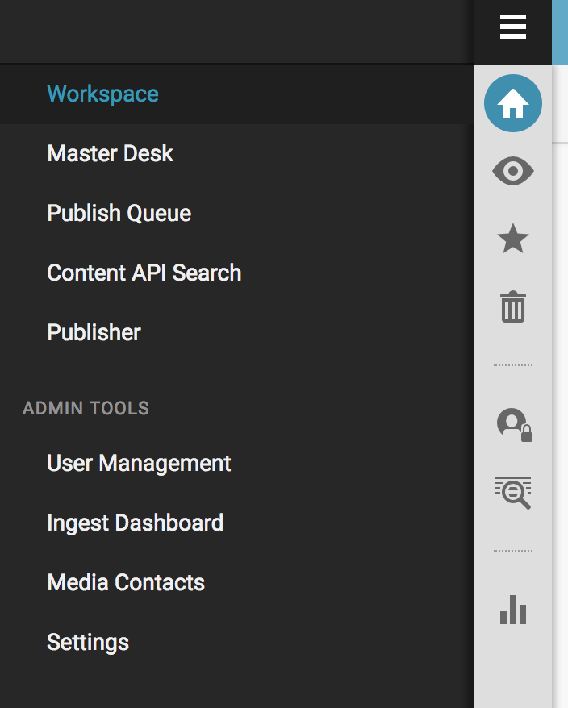

How to Install and Configure Superdesk Publisher with Superdesk
===============================================================

This guide describes how to connect your Publisher instance with a Superdesk server to run
both applications concurrently in a production environment on two **different** servers.
(However, both applications can also work on a single machine.)

This guide assumes that you have:

- A working instance of Superdesk
- A working instance of Superdesk Publisher

For this guide, we will assume your Superdesk server runs on ``superdesk.example.com`` and your Publisher server
runs on ``example.com``.

Install the Superdesk Publisher Component in Superdesk
------------------------------------------------------

Login to the server where Superdesk is installed.

Superdesk Publisher Component is a JavaScript component that is a separate dependency
and can be included in Superdesk to manage your Superdesk Publisher application.

To add this component as a dependency edit ``/opt/superdesk/client/package.json`` and include the 
Superdesk Publisher repository:

.. code-block:: js

	"dependencies": {
		....,
		"superdesk-publisher": "superdesk/superdesk-publisher#master"
	}

You can replace master with whichever branch you require.

Next, run the following command to install the ``package.json`` dependencies:

.. code-block:: bash

	npm install

Update Your Superdesk Configuration File
----------------------------------------

Inside ``/opt/superdesk/client`` directory on your server open the ``superdesk.config.js``
and integrate the following code with your existing configuration:

.. code-block:: js

	apps: [
		....,
		'superdesk-publisher'
	],
	importApps: [
		....,
		'superdesk-publisher'
	]
	publisher: {
		protocol: 'http',                /* http or https */
		tenant: '',                      /* tenant - semantically subdomain, '' is allowed */
		domain: 'example.com',           /* domain name for the publisher */
		base: 'api/v2',                  /* api base path */

		wsProtocol: 'wss',                /* ws or wss (websocket); if unspecified or '' defaults to 'wss' */
		wsDomain: 'WebSocketDomain.com',  /* domain name (usually domain as above) */
										  /* e.g.: example.com, abc.example.com */
										  /* tenant, as above, is NOT used for websocket */
		wsPath: '/ws',                    /* path to websocket root dir */
		wsPort: '8080'                    /* if not specified: defaults to 443 for wss, 80 for ws */
	},

Finally, rebuild the front-end by running this command:

.. code-block:: bash

	grunt build

Update Your Publisher Configuration File
----------------------------------------

Login to the server where Publisher is installed.

Edit (or create, if it doesn't already exist) the file ``/var/www/publisher/.env.local`` and add the following:

.. code-block:: env

	SUPERDESK_SERVERS='["superdesk.example.com"]'
	CORS_ALLOW_ORIGIN=http://superdesk.example.com

.. NOTE::

	For CORS_ALLOW_ORIGIN, it is important to include the protocol your Superdesk server uses (http or https) and 
	to not have a trailing slash after your domain name (e.g. your value should not be http://superdesk.example.com/).

Clear the Publisher server cache for the change to take effect:

.. code-block:: bash

	php bin/console cache:clear

That’s it! Now, when you log in to Superdesk in the left hamburger menu, you will see the Publisher menu item available:

2. Configure Subscriber to Publish Content from Superdesk to Superdesk Publisher
--------------------------------------------------------------------------------

You can read more about this in the official Superdesk Publisher `documentation`_.

.. _documentation: http://superdesk-publisher.readthedocs.io/en/latest/manual/getting_started/superdesk-configuration.html#publish
