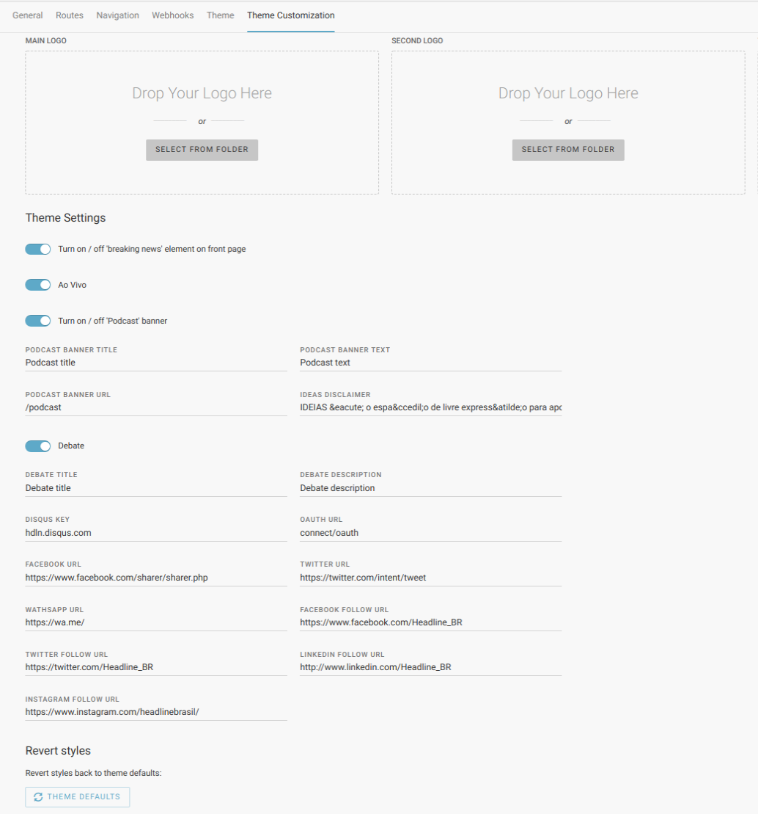

Theme Settings
--------------

Theme settings are defined in the ``theme.json`` configuration file which should be in every theme directory.

An example of ``theme.json`` file with defined settings will look like:

.. code-block:: json

    {
        "name": "swp/default-theme",
        "title": "Default Theme",
        "description": "Superdesk Publisher default theme",
        "authors": [
            {
                "name": "Sourcefabric z.ú.",
                "email": "contact@sourcefabric.org",
                "homepage": "https://www.sourcefabric.org",
                "role": "Organization"
            }
        ],
        "settings": {
            "primary_font_family": {
                "label": "Primary Font Family",
                "value": "Roboto",
                "type": "string",
                "help": "The primary font",
                "options": [
                    {"value": "Roboto", "label": "Roboto"},
                    {"value": "Lato", "label": "Lato"},
                    {"value": "Oswald", "label": "Oswald"}
                ]
            },
            "secondary_font_family": {
                "value": "Roboto",
                "type": "string",
                "options": [
                    {"value": "Roboto", "label": "Roboto"},
                    {"value": "Lato", "label": "Lato"},
                    {"value": "Oswald", "label": "Oswald"}
                ]
            },
            "body_font_size": {
                "label": "Body Font Size",
                "value": 14,
                "type": "integer",
                "options": [
                    {"value": 14, "label": "14px"},
                    {"value": 16, "label": "16px"},
                    {"value": 18, "label": "18px"}
                ]
            }
        }
    }

In the ``settings`` property of the JSON file you will find the default theme's settings.

Each setting can be overridden through the Publisher settings interface or by the API (for this, see ``/settings/`` API endpoint for more details in the ``/api/doc`` route in your Superdesk Publisher instance).

Read more about settings in the :doc:`Settings </bundles/SWPSettingsBundle/settings_definitions>` chapter to find out more.

Every setting is a JSON object which may contain the following properties:

- ``label`` - Setting's label, will be visible in API when defined,
- ``value`` - Setting's value, will be visible in API when defined,
- ``type`` - Setting's type, either it's ``string``, ``integer``, ``boolean`` or ``array``.
- ``help`` - Settins's helper text.
- ``options`` - an array of optional values that can be used to implement select box.

Read more about theme structure in the :doc:`Themes </manual/themes/index>` chapter.

How to display the current theme settings in templates?
`````````````````````````````````````````````````````

.. code-block:: twig

    {# app/themes/<tenant_code>/<theme_name>/views/index.html.twig #}
    {{ themeSetting('primary_font_family') }} # will print "Roboto"

<<<<<<< HEAD
In development environment, if the theme's setting doesn't exists an exception will be thrown with a proper message that it does not exist.
In production environment no exception will be thrown, the page will render normally.
=======
If the theme's setting doesn't exist, an exception will be thrown with a  message that it does not exist.
>>>>>>> 4299c6dc97f783891c6a42164727d214c9b500ce


How to work with theme settings in the GUI
``````````````````````````````````````


In Publisher's Website management, after selecting your desired tenant (if there is more than one), the last 'tab' in horizontal navigation will be 'Theme customization'. This is a graphical representation of theme.json - all the fields and default settings you set there, are visible on this screen, and can be updated. 

Based on these custom values, there are dialogues to manage up to three logos. It is meant to be be used for quick adjustments of example themes (header and footer logos, or maybe logo on inner pages if it is somehow different than the main one), but these custom upload files can be incorporated into the site in other ways; for example they can be used for graphical announcements / banners that are changed by site editors from time to time.

How to display current theme's settings using an API?
``````````````````````````````````````````````````

Theme settings can be accessed by calling an ``/theme/settings/`` API endpoint using ``GET`` method.

How to update current theme settings using an API?
`````````````````````````````````````````````````

To update theme settings using an API, a ``PATCH`` request must be submitted to the ``/settings/`` endpoint with the
JSON payload:

.. code-block:: twig

    {
        "settings": {
            "name": "primary_font_family",
            "value": "custom font"
        }
    }

How to restore current theme settings using an API?
``````````````````````````````````````````````````

There is an option to restore the current theme settings to the default ones, defined in the ``theme.json`` file.

This can be done using the API and calling a ``/settings/revert/{scope}`` endpoint using the ``POST`` method.
The ``scope`` parameter should be set to ``theme`` in order to restore settings for the current theme.
